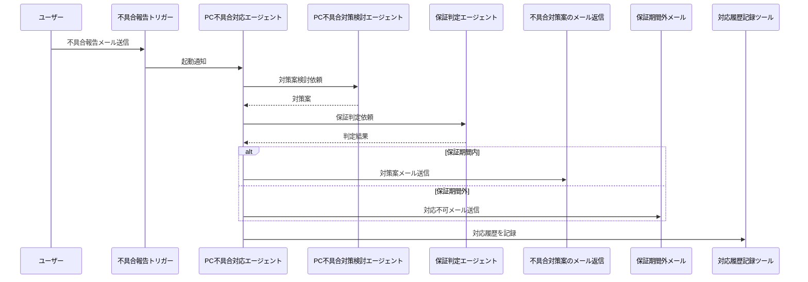

# 📘 Copilot Studio Solution: PC不具合対応ワークフロー

このリポジトリは、https://learn.microsoft.com/power-platform/ の **Copilot Studio** を用いて構築した「PC不具合対応ワークフロー」のソリューションです。  
ユーザーからの不具合報告を受け付け、保証期間の判定、対策案の提示、対応履歴の記録までを自動化するエージェント群とツールを実装しています。

---

## 🧩 構成

本ソリューションは以下の **親エージェント** と **子エージェント**、および **ツール** で構成されています。

### 👑 親エージェント

- **PC不具合対応エージェント**  
  ユーザーからの不具合報告に基づき、全体のワークフローを統括し、適切な子エージェントやツールを呼び出して対策案を検討します。

### 🧒 子エージェント

- **PC不具合対策検討エージェント**  
  不具合の内容に応じて具体的な対策案を検討します。

- **保証判定エージェント**  
  本日の日付とシリアル番号をもとに、保証期間内かどうかを判定します。

### 🛠️ ツール

- **不具合対策案のメール返信**  
  保証期間内の場合、対策案をメールで返信します。

- **保証期間外のため対応ができない旨のメール**  
  保証期間外の場合、対応できない旨をメールで返信します。

- **保守サービスシステムへの対応履歴の記録**  
  対応内容を保守サービスシステムに記録します。

---

## 📊 シーケンス図




## 🚀 導入方法

1. https://github.com/your-org/copilotstudio-pc-issue-workflow/releases から最新のソリューションファイル (.zip) をダウンロードします。

2. https://make.powerapps.com/ にアクセスし、Power Platform 環境にソリューションをインポートします。
   - 左側メニューの **「ソリューション」** を選択し、**「インポート」** をクリックします。
   - ダウンロードした .zip ファイルを選択してインポートします。

3. インポート後、**すべてのカスタマイズを公開** します。


4. モデル駆動型アプリ`受注管理アプリ`を開きます。


5. 1年以内の販売日を選択し、保存します。


6. 保存すると出力されるシリアル番号をメモしておきます。


7. エージェントにメールを送信します。件名には、`不具合報告`といれる必要があります。
>[!Note]
>デモ用に不具合報告を入れたときだけトリガーされるようにしていますが、トリガーに設定されているフローにて変更できます。

8. メールをインポートしたユーザーに対して送信します。以下の本文を参考に利用してください。シリアル番号はメモした内容を利用してください。


```デモ用のメール文章
ご担当者様

お世話になっております。田中と申します。

購入したSurface Laptop にトラブルがあります。
正しく電源コードはつなげていますが電源ボタンを押しても起動しません。どのようにすればよいでしょうか。
ちなみに充電ランプは点灯しています。

シリアル番号: {ここにシリアル番号をいれる}

よろしくお願いいたします。

高橋太郎

```
9. 暫く待つと、自動的にメールがエージェントにより作成され返信されます。


エージェントにより、このように自動的な判断と処理がなされています。


---

## 🔗 参考情報（Microsoft公式ドキュメント）

以下の公式ドキュメントが参考になります。

- https://learn.microsoft.com/power-platform/
- [Power Apps ソリューションのインポート](https://learn.microsoft.com/power-apps/maker/data-platform/import-update-exporte の接続とコネクタ](https://learn.microsoft.com/power-automate/conarn.microsoft.com/power-virtual-agents/overview
- https://learn.microsoft.com/power-platform/admin/environments-overview
- https://learn.microsoft.com/power-automate/fix-flow-failures

---

他にも必要に応じて、具体的なエラーコードやスクリーンショットをもとにサポートしますので、お気軽にご相談ください！

