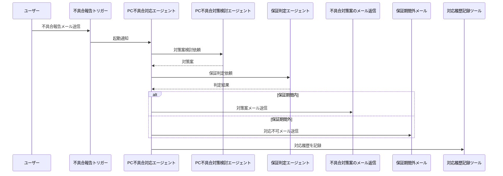

# 📘 Copilot Studio Solution: PC不具合対応エージェント

**Copilot Studio** を用いて構築した「PC不具合対応エージェント」のソリューションです。  
ユーザーからの不具合報告をメールで受け付け、保証期間の判定、対策案の提示、対応履歴の記録までを自動化するエージェント群とツール

## PC不具合対応エージェント
PC不具合対応エージェントは、Surface の不具合対応を題材とした以下の作業を代行する、サポート担当者向けのAIエージェントです。

💬 PC製品の不具合報告メールに対して、自動的に起動

🔍 CRMから販売日を取得し、社内マニュアルに基づき保証判定

✉️ ナレッジに基づき対策方法、またはサポート契約のご提案メール返信の実行

📝 対応履歴の登録

---

## 動画

https://github.com/user-attachments/assets/b8d7bdc7-f29d-4815-a419-877efc1d83e5

---

## 🧩 構成

本ソリューションは以下の **親エージェント** と **子エージェント**、および **ツール** で構成されています。


### 👑 親エージェント


- **PC不具合対応エージェント**  
  ユーザーからの不具合報告に基づき、全体のワークフローを統括し、適切な子エージェントやツールを呼び出して対策案を検討します。

### 🧒 子エージェント

- **PC不具合対策検討エージェント**  
  不具合の内容に応じて具体的な対策案を検討します。

- **保証判定エージェント**  
  本日の日付とシリアル番号をもとに、保証期間内かどうかを判定します。

### 🛠️ ツール

- **不具合対策案のメール返信**  
  保証期間内の場合、対策案をメールで返信します。

- **保証期間外のため対応ができない旨のメール**  
  保証期間外の場合、対応できない旨をメールで返信します。

- **保守サービスシステムへの対応履歴の記録**  
  対応内容を保守サービスシステムに記録します。

---

## 📊 処理の流れ




## 🚀 導入方法

1. [このリポジトリのリリース](https://github.com/geekfujiwara/IncidentAutoReplyAgent/releases)から最新のソリューションファイル (.zip) をダウンロードします。

2. https://make.powerapps.com/ にアクセスし、Power Platform 環境にソリューションをインポートします。
   - 左側メニューの **「ソリューション」** を選択し、**「インポート」** をクリックします。
   - ダウンロードした .zip ファイルを選択してインポートします。

3. インポート後、**すべてのカスタマイズを公開** します。


4. 親エージェントであるPC不具合対応エージェントを開きます。その接続情報を更新します。設定からすべて接続して状態を接続済みにします。


ここまでで導入は完了です。次は実際にテストしてみます。

テストシナリオは以下の2種類あります。

1. 保証期間内の場合
2. 保証期間外の場合
---
### (1) 保証期間内の場合

1. モデル駆動型アプリ`受注管理アプリ`を開きます。


2. 1年以内の販売日を選択し、保存します。


3. 保存すると出力されるシリアル番号をメモしておきます。


4. エージェントにメールを送信します。件名には、`不具合報告`といれる必要があります。
>[!Note]
>デモ用に不具合報告を入れたときだけトリガーされるようにしていますが、トリガーに設定されているフローにて変更できます。

5. メールをインポートしたユーザーに対して送信します。以下の本文を参考に利用してください。シリアル番号はメモした内容を利用してください。

```デモ用のメール文章
ご担当者様

お世話になっております。田中と申します。

購入したSurface Laptop にトラブルがあります。
正しく電源コードはつなげていますが電源ボタンを押しても起動しません。どのようにすればよいでしょうか。
ちなみに充電ランプは点灯しています。

シリアル番号: {ここにシリアル番号をいれる}

よろしくお願いいたします。

高橋太郎

```
6. 暫く待つと、自動的にメールがエージェントにより作成され返信されます。


エージェントにより、このように自動的な判断と処理がなされています。


7. エージェントは同時に対応履歴を残してくれています。モデル駆動型アプリから対応履歴を確認することができます。


### (2) 保証期間外の場合
販売日が1年以上前の受注を作成してそのシリアル番号でメールを送信した場合、どのような処理がなされるかを確認します。
1. 販売日が1年以上前の受注を作成します。


2. シリアル番号を本文に入れ、不具合報告メールを送信します。
エージェントは以下のように処理を行います。


3. しばらくすると、エージェントから対応できない&サポート契約の提案を行うメール返信が行われます。


4. モデル駆動型アプリに対応履歴が記録されていることを確認します。


---

